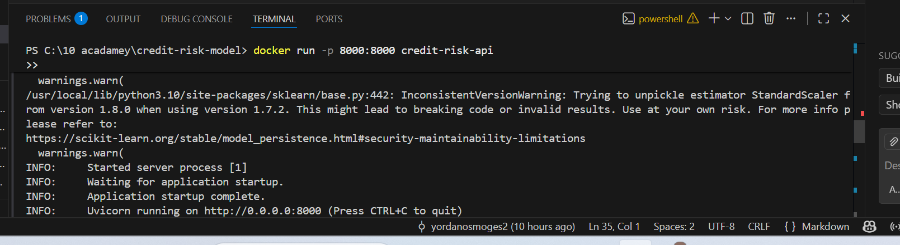
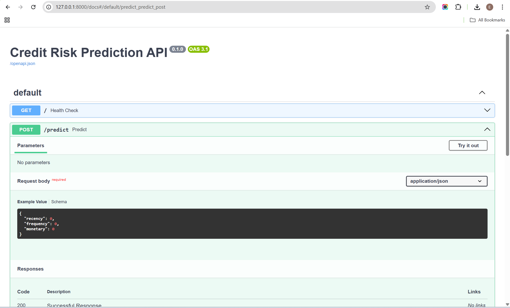

## Credit Scoring Business Understanding

### Basel II and the Need for Interpretability and Documentation
The Basel II Capital Accord emphasizes accurate measurement, monitoring, and management of credit risk, requiring financial institutions to clearly justify how risk is assessed and how capital adequacy is maintained. As a result, credit risk models must be **interpretable, transparent, and well-documented** to support regulatory review, internal validation, and audit requirements.

In this project, interpretability is treated as a first-class requirement. The modeling approach prioritizes techniques whose decisions can be explained to regulators, risk managers, and business stakeholders. Clear documentation of data sources, feature engineering steps, modeling assumptions, and evaluation results ensures **reproducibility, auditability, and regulatory compliance**, all of which are essential in a regulated credit risk environment.

---

### Proxy Target Variable Justification and Associated Business Risks
The provided dataset originates from **eCommerce transaction data** and does not contain an explicit loan default or delinquency label. To enable supervised learning for credit risk modeling, a **proxy target variable** is required.

In this project, customer engagement behavior derived from **Recency, Frequency, and Monetary (RFM)** metrics is used as a proxy for credit risk. Customers exhibiting low engagement (high recency, low frequency, and low monetary value) are classified as higher risk, under the assumption that disengaged customers are more likely to default or represent unfavorable credit behavior.

The use of a proxy target introduces several business risks:
- Customers may be temporarily inactive rather than truly high risk
- Behavioral patterns may introduce bias unrelated to actual creditworthiness
- Decisions based on proxy risk may differ from outcomes based on real default data

These risks are explicitly acknowledged, and the proxy is treated as a **modeling approximation** rather than a definitive representation of credit default.

---

### Trade-offs Between Interpretable and Complex Models in Credit Risk
Credit risk modeling involves a trade-off between **model interpretability** and **predictive performance**. Interpretable models such as Logistic Regression are widely used in regulated environments because they are easier to explain, validate, and govern. When combined with structured features such as RFM metrics (and potentially WoE/IV in future iterations), they support transparent decision-making aligned with regulatory expectations.

More complex models, such as ensemble-based methods (e.g., Random Forests or Gradient Boosting), can capture nonlinear relationships and interactions, often resulting in improved predictive performance. However, they are harder to interpret and typically require additional explainability tools, monitoring, and governance controls.

In this project, both model types are explored and compared. The final design emphasizes **balanced decision-making**, where predictive accuracy is evaluated alongside transparency, compliance, and operational trust, consistent with real-world credit risk management practices.

---

### Practical Implementation and Deployment Considerations
Beyond modeling, this project demonstrates how credit risk solutions can be operationalized. The trained model is exposed through a **FastAPI-based prediction service** and containerized using **Docker**, enabling reproducible deployment across environments. This approach reflects modern credit risk systems, where models must not only be accurate and interpretable, but also **deployable, maintainable, and auditable** in production settings.

---

## API Deployment and Usage

### Dockerized FastAPI Service
The trained credit risk model is deployed as a REST API using **FastAPI** and containerized with **Docker**. This setup ensures consistent, reproducible deployment across environments and reflects real-world model serving practices.

The following screenshots demonstrate the successful deployment and usage of the API.

### Docker Container Running

The screenshot above shows the FastAPI application running inside a Docker container, with the service listening on port 8000.

### API Documentation (Swagger UI)

The Swagger UI provides an interactive interface for testing the `/predict` endpoint. Users can submit Recency, Frequency, and Monetary values and receive a predicted credit risk probability.

### Weight of Evidence (WoE) and Information Value (IV)
To improve interpretability and align with credit risk best practices, a WoE/IV
transformation step was implemented for selected features. This allows the model
to capture monotonic risk relationships while remaining explainable and regulator-friendly.

Basic unit tests were added and executed using pytest to validate data flow and
model components.

## Continuous Integration

A Continuous Integration (CI) pipeline is implemented using **GitHub Actions**.  
The pipeline automatically installs dependencies and runs unit tests using **pytest** on every push and pull request to the main branch, ensuring code quality and preventing regressions.

### MLflow-based Model Loading

The FastAPI service loads the trained credit risk model directly from MLflow
using a model URI. This ensures consistency between training and inference,
supports versioned deployments, and enables auditable, production-ready
model serving aligned with MLOps best practices.

